<p align="center">
  
</p>

<p align="center">
  
  
  
  
  
</p>

<p align="center">
  <b>Alarms for a garage and the rooms next to it</b> — smoke, water, motion, temperature —<br>
  delivered to Telegram.
</p>


<p align="center">
  <b>➡️ garageAlarms 2.0 — the hubless network that replaces this box — now lives in
  <a href="https://github.com/Lindenson/garageAlarms2.0">Lindenson/garageAlarms2.0</a></b><br>
  intent, concept, architecture, UX, roadmap and all planning documents are there.
</p>

---

This repository is **garageAlarms 1.x**, the firmware guarding the garage today. It stays in
service until garageAlarms 2.0 passes its acceptance test (epic 5 of the 2.0 roadmap).

## garageAlarms 1.x (current firmware)

An ESP32-S3 bridge between two dry-contact sensors in a garage — smoke and motion — and
Telegram. Contacts close, the people who subscribed to the bot get a message.

<details open>
<summary><b>Features</b></summary>

- Alerts fan out to every subscriber, queued and retried until delivered
- The queue, the subscriber list and the mute window live in NVS, so a power cut loses nothing
- Time-based debounce with a per-input cooldown — one real event produces one message
- Inline Telegram menu that edits itself in place instead of filling the chat with copies
- `/status` with link quality, uptime, reboot count and the reason for the last reset
- `/mute 4` silences chatter for four hours; a smoke alarm is never silenced
- Daily heartbeat, so silence from the bot is unambiguous
- Subscription is gated by a shared PIN
- Stuck-input detection: a motion contact held for hours is reported as a wiring fault
- LED status: hunting for WiFi, alerts queued, or idle

</details>

<details>
<summary><b>Hardware</b></summary>

| | |
|---|---|
| Board | ESP32-S3 (developed on an N16R8 module, 16 MB flash) |
| GPIO 17 | smoke / alarm contact — `INPUT_PULLUP`, active **LOW** |
| GPIO 18 | motion detector — `INPUT_PULLDOWN`, active **HIGH** |
| GPIO 48 | status LED (the variant's addressable `LED_BUILTIN`) |

The two inputs have **opposite polarity**, and each is pulled toward its *inactive* level, so
a cut wire reads as quiet rather than as an alarm.

Plain ESP32 is not supported: the code uses `INPUT_PULLDOWN`, and the reset-reason mapping
covers the S3's USB and JTAG resets. On an ESP32-C3 these pin choices would clash with USB
(GPIO18/19 are D−/D+ there).

</details>

<details>
<summary><b>Build</b></summary>

```bash
cp secrets.example.h secrets.h    # then fill it in
arduino-cli compile --fqbn "esp32:esp32:esp32s3:CDCOnBoot=cdc,FlashSize=16M,PartitionScheme=min_spiffs" .
arduino-cli upload  --fqbn "esp32:esp32:esp32s3:CDCOnBoot=cdc,FlashSize=16M,PartitionScheme=min_spiffs" -p /dev/ttyACM0 .
```

`CDCOnBoot=cdc` matters: without it `Serial` goes to the UART pins and you get no log over
USB. Verified against ESP32 core 3.3.11 and ArduinoJson 7.4.2.

`secrets.h` holds the WiFi credentials, the bot token from [@BotFather](https://t.me/BotFather),
your own chat id, and the subscription PIN. It is gitignored and has never been committed.

> [!WARNING]
> `OWNER_CHAT_ID` must be **your** Telegram user id (get it from @JsonDumpBot), not the bot's id
> — the part of the token before the colon is the bot, and using it silently disables the
> owner-only features.

</details>

<details>
<summary><b>Bot commands</b></summary>

| | |
|---|---|
| `/subscribe <PIN>` | start receiving alerts |
| `/status` | system state |
| `/mute 4` / `/unmute` | silence non-critical alerts for N hours |
| `/test` | check that delivery works |
| `/menu`, `/help` | menu and reference |
| `/who`, `/reboot` | owner only |

Bot messages are in Russian; code and comments are in English.

</details>

<details>
<summary><b>The vendored library</b></summary>

`src/AsyncTelegram2/` is [AsyncTelegram2](https://github.com/cotestatnt/AsyncTelegram2) 2.3.3
with fixes, each marked `PATCHED (garageAlarms)`. It is vendored rather than used from
`libraries/` because without these fixes the firmware reboots in a loop on a weak link.

The one that mattered: the body-read loop in `getUpdates()` used

```c
for (uint32_t timeout = millis(); (millis() - timeout > 1000) || pos < len;)
```

The first clause becomes true once a second has elapsed and never becomes false again, so any
response that takes over a second to read spins forever with no yield — task watchdog, reset.
On a weak WiFi link that fires constantly, and since the original sketch announced itself from
`setup()`, every reset became a Telegram message. The "flood of reconnect messages" was a
reboot loop.

Also fixed: an unbounded header-skip loop, a tight spin in the blocking send path, ArduinoJson
7 compatibility, a missing `parse_mode` on `editMessage`, `callback_query_id` sent as a number
instead of a string, and a non-blocking send that always reported failure — which made a
retrying caller deliver every message six times.

See [`CLAUDE.md`](CLAUDE.md) for the architecture in more detail.

</details>

<details>
<summary><b>Known limitation</b></summary>

Sensors are sampled from `loop()`, and a Telegram send blocks for up to a few hundred
milliseconds, so a pulse shorter than one send could be missed. This is deliberate: latching
edges in an ISR would also latch microsecond noise spikes, which is the failure mode the
debounce exists to prevent. It is safe here because both inputs are latching contacts that
hold for seconds.

</details>


## License

[MIT](LICENSE) for this project's own code. The vendored library keeps its upstream license.
