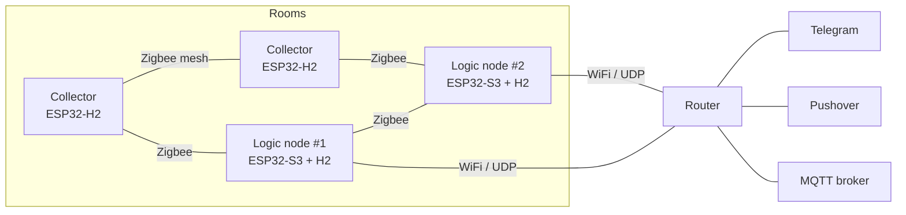

# garageAlarms

Alarms for a garage and the rooms next to it — smoke, water, motion, temperature — delivered
to Telegram (and, in 2.0, to Pushover and MQTT).

This repository holds two things:

- **garageAlarms 1.x** — the firmware running in the garage today: one ESP32-S3, two
  dry-contact inputs, a Telegram bot. See [1.x firmware](#garagealarms-1x-current-firmware).
- **The plan for garageAlarms 2.0** — a decentralized network of nodes that replaces the
  single box. Planning is complete; implementation starts in a new repository,
  `garageAlarms2.0`. See [Intent](#intent), [Concept](#concept-garagealarms-20) and
  [Roadmap](#roadmap).

## Intent

It is an alarm system, so the priorities are, in order:

1. **never miss or silently drop an event**,
2. **never flood the user**,
3. everything else.

Every decision in both versions is resolved against that ordering. 1.x serves it well within one
box, but the box itself is the limit:

| 1.x limitation | Consequence |
| --- | --- |
| One device, one WiFi link | a weak router signal or a dead box silences the garage |
| Inputs are pulled toward "quiet" | a cut wire looks exactly like "nothing happening" |
| Two fixed inputs | no water, temperature, CO₂, or sensors in other rooms |
| Telegram only | an alarm at 3 a.m. on a silenced phone is easy to sleep through |
| Logic is compiled in | no "water in two rooms", "motion garage → corridor", modes like "away" |

**2.0 exists to remove the single point of failure and add shared logic across rooms — without
giving up the ordering above.** Duplicates are acceptable; losses are not.

## Concept: garageAlarms 2.0

A network of nodes in adjacent rooms, **with no central hub**.



**Two kinds of devices**

- **Logic nodes** (2 or more; ESP32-S3 with an ESP32-H2 as its Zigbee radio, FRAM for
  persistence). Each holds a full replica of the outbound queue, configuration and rules, runs
  every rule, and serves the local web UI. One of them is the **leader** and talks to the
  outside world; the others shadow it and take over.
- **Collectors** (ESP32-H2). Read sensors and forward events over the Zigbee mesh, relaying for
  each other. No logic of their own.

**How an alarm survives failures**

- Every event carries a unique id `(node, boot, seq)`, is stored before it is acknowledged, and
  is retried to **every** live logic node until each confirms. Logic nodes also reconcile what
  they have received with each other.
- The leader is the live logic node with a working uplink, the best configured priority, then
  the lowest hardware id. A follower that does not see a critical alarm marked as delivered
  within ~45 s sends it itself.
- If the internal network splits and two nodes both think they lead, **Telegram is the
  arbiter**: a second poller triggers `409 Conflict`, and a lease held as a pinned message in
  the owner's chat decides who yields (verified against the real Bot API).
- Wires are supervised with end-of-line resistors, so a cut or shorted loop is a fault, not
  silence. Silent nodes and sensors raise health events.

**What people see**

- **Telegram bot** for everyday use — status, sensors by zone, event history, «Принято» (ack)
  on alarms, modes (home / away / night), personal and global mute. Roles: owner, operator,
  subscriber.
- **Pushover** emergency alerts for critical events to the whole family, repeating until
  someone acknowledges; an ack in any channel stops repeats everywhere.
- **Local web UI** (LAN only, HTTPS with the system's own CA) for all configuration: nodes,
  sensors, zones and their adjacency graph, rules, credentials, MQTT, updates.
- **Rules** from nine templates (threshold, rate of change, health, coincidence, chain, trace
  across zones, aggregation, action, mode/schedule) with an optional `when` condition.
- **Sensors** through a driver gateway for 1-Wire and I²C: a new sensor type is one driver
  file and a rebuild. Starting set: DS18B20, SHT3x/4x, BME280/680/688, SGP40/41, SCD40/41,
  BH1750, VEML7700, INA219, ADS1115, plus dry contacts and pulse counters.
- **MQTT mirror** as an optional output with its own bounded buffer — it can never push an
  alarm out of the main queue.

**Stack:** ESP-IDF v6.0 + FreeRTOS, actor model (one task per layer, message passing),
esp-zigbee-lib 2.0 in distributed-security mode (no coordinator), CBOR between nodes, OTA for
every node one at a time with rollback.

## Roadmap

Nine epics, 67 stories. Each epic delivers something that works on its own.

| # | Epic | Outcome |
| --- | --- | --- |
| 1 | Prototype confirms the hardware | S3 ↔ H2 radio link, Zigbee without a coordinator, loss under WiFi load, Zigbee OTA from a router — measured before building on them |
| 2 | First alarm through the network | dry contact on a collector → mesh → logic node → FRAM → Telegram; USB provisioning, encrypted secrets, signed frames |
| 3 | No single point of failure | two logic nodes, heartbeat, leader and Telegram lease, replication, UDP second path, critical-alarm backup; bench chaos test |
| 4 | Notification and acknowledgement | full Telegram UI, Pushover until acknowledged, shared ack, daily report, reboot notices |
| 5 | OTA, secure setup, **replacing 1.x** | OTA for all nodes, phone-based setup, secure boot for production nodes, end-of-line loops; acceptance test, then 1.x is switched off |
| 6 | Local web configuration | nodes, sensors, zones, leadership, subscribers, conflicts, export/import |
| 7 | Sensors and their health | channel model, driver gateway and starting set, 12 V and 220 V supervision |
| 8 | Rules and shared logic | nine templates, `when`, modes, chains, coincidences, traces, rule editor |
| 9 | MQTT mirror | events, states and health to the user's broker |

**Status (2026-09-30):** planning complete; prototype hardware ordered
([bill of materials](_bmad-output/planning-artifacts/bill-of-materials.md)). Stories 1.1 and
1.2 need no hardware and can start now. The 1.x box stays in service until epic 5.

### Planning documents

All planning was done with the BMad method and lives under `_bmad-output/` (in Russian):

| Document | What it fixes |
| --- | --- |
| [Idea: device network](_bmad-output/forge/garage-device-network/forged-idea.md) | decentralized AP model, node classes, Telegram arbiter |
| [Idea: rules and config](_bmad-output/forge/rules-config-model/forged-idea.md) | configuration levels, channel model, rule templates |
| [Architecture spine](_bmad-output/planning-artifacts/architecture/architecture-garageAlarms-2026-09-29/ARCHITECTURE-SPINE.md) | 25 binding decisions (AD-1…AD-25) |
| [Specification](_bmad-output/specs/spec-garage-alarms-2/SPEC.md) | 13 capabilities, constraints, non-goals, success signal + companions |
| [UX: design](_bmad-output/planning-artifacts/ux-designs/ux-garageAlarms-2026-09-30/DESIGN.md) · [UX: experience](_bmad-output/planning-artifacts/ux-designs/ux-garageAlarms-2026-09-30/EXPERIENCE.md) | dark "Cold Steel" theme, bot menus, web sections, setup flows, mockups |
| [Epics and stories](_bmad-output/planning-artifacts/epics.md) | 36 FR, 12 NFR, 69 UX requirements, 9 epics, 67 stories |
| [Bill of materials](_bmad-output/planning-artifacts/bill-of-materials.md) | prototype bench: 2 logic nodes + 2 collectors |

---

## garageAlarms 1.x (current firmware)

An ESP32-S3 bridge between two dry-contact sensors in a garage — smoke and motion — and
Telegram. Contacts close, the people who subscribed to the bot get a message.

### Features

- Alerts fan out to every subscriber, queued and retried until delivered
- The queue, the subscriber list and the mute window live in NVS, so a power cut loses nothing
- Time-based debounce with a per-input cooldown — one real event produces one message
- Inline Telegram menu that edits itself in place instead of filling the chat with copies
- `/status` with link quality, uptime, reboot count and the reason for the last reset
- `/mute 4` silences chatter for four hours; a smoke alarm is never silenced
- Daily heartbeat, so silence from the bot is unambiguous
- Subscription is gated by a shared PIN
- Stuck-input detection: a motion contact held for hours is reported as a wiring fault
- LED status: hunting for WiFi, alerts queued, or idle

### Hardware

| | |
|---|---|
| Board | ESP32-S3 (developed on an N16R8 module, 16 MB flash) |
| GPIO 17 | smoke / alarm contact — `INPUT_PULLUP`, active **LOW** |
| GPIO 18 | motion detector — `INPUT_PULLDOWN`, active **HIGH** |
| GPIO 48 | status LED (the variant's addressable `LED_BUILTIN`) |

The two inputs have **opposite polarity**, and each is pulled toward its *inactive* level, so
a cut wire reads as quiet rather than as an alarm.

Plain ESP32 is not supported: the code uses `INPUT_PULLDOWN`, and the reset-reason mapping
covers the S3's USB and JTAG resets. On an ESP32-C3 these pin choices would clash with USB
(GPIO18/19 are D−/D+ there).

### Build

```bash
cp secrets.example.h secrets.h    # then fill it in
arduino-cli compile --fqbn "esp32:esp32:esp32s3:CDCOnBoot=cdc,FlashSize=16M,PartitionScheme=min_spiffs" .
arduino-cli upload  --fqbn "esp32:esp32:esp32s3:CDCOnBoot=cdc,FlashSize=16M,PartitionScheme=min_spiffs" -p /dev/ttyACM0 .
```

`CDCOnBoot=cdc` matters: without it `Serial` goes to the UART pins and you get no log over
USB. Verified against ESP32 core 3.3.11 and ArduinoJson 7.4.2.

`secrets.h` holds the WiFi credentials, the bot token from [@BotFather](https://t.me/BotFather),
your own chat id, and the subscription PIN. It is gitignored and has never been committed.
`OWNER_CHAT_ID` must be **your** Telegram user id (get it from @JsonDumpBot), not the bot's id
— the part of the token before the colon is the bot, and using it silently disables the
owner-only features.

### Bot commands

| | |
|---|---|
| `/subscribe <PIN>` | start receiving alerts |
| `/status` | system state |
| `/mute 4` / `/unmute` | silence non-critical alerts for N hours |
| `/test` | check that delivery works |
| `/menu`, `/help` | menu and reference |
| `/who`, `/reboot` | owner only |

Bot messages are in Russian; code and comments are in English.

### The vendored library

`src/AsyncTelegram2/` is [AsyncTelegram2](https://github.com/cotestatnt/AsyncTelegram2) 2.3.3
with fixes, each marked `PATCHED (garageAlarms)`. It is vendored rather than used from
`libraries/` because without these fixes the firmware reboots in a loop on a weak link.

The one that mattered: the body-read loop in `getUpdates()` used

```c
for (uint32_t timeout = millis(); (millis() - timeout > 1000) || pos < len;)
```

The first clause becomes true once a second has elapsed and never becomes false again, so any
response that takes over a second to read spins forever with no yield — task watchdog, reset.
On a weak WiFi link that fires constantly, and since the original sketch announced itself from
`setup()`, every reset became a Telegram message. The "flood of reconnect messages" was a
reboot loop.

Also fixed: an unbounded header-skip loop, a tight spin in the blocking send path, ArduinoJson
7 compatibility, a missing `parse_mode` on `editMessage`, `callback_query_id` sent as a number
instead of a string, and a non-blocking send that always reported failure — which made a
retrying caller deliver every message six times.

See `CLAUDE.md` for the architecture in more detail.

### Known limitation

Sensors are sampled from `loop()`, and a Telegram send blocks for up to a few hundred
milliseconds, so a pulse shorter than one send could be missed. This is deliberate: latching
edges in an ISR would also latch microsecond noise spikes, which is the failure mode the
debounce exists to prevent. It is safe here because both inputs are latching contacts that
hold for seconds.

## License

MIT for this project's own code. The vendored library keeps its upstream license.
